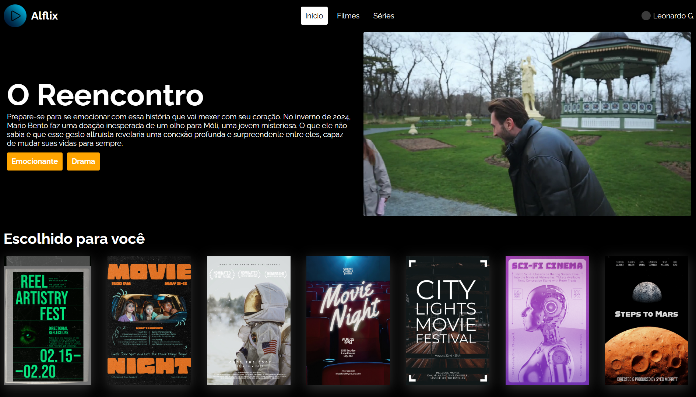

# 🎥 Streaming Video Demo  



## 📌 Introdução  

Este projeto demonstra uma implementação básica de streaming de vídeo utilizando tecnologias HTML5. Ele fornece uma interface web simples para transmitir conteúdo de vídeo aos usuários.  

## 📖 Índice  

- [📌 Introdução](#-introdução)  
- [✨ Funcionalidades](#-funcionalidades)  
- [⚙️ Instalação](#-instalação)  
- [▶️ Uso](#-uso)  
- [📦 Dependências](#-dependências)  
- [👥 Contribuidores](#-contribuidores)  
- [📜 Licença](#-licença)  

## ✨ Funcionalidades  

✅ **Streaming de Vídeo**: Transmite conteúdo de vídeo usando elementos HTML5.  
✅ **Design Responsivo**: Compatível com diversos dispositivos e tamanhos de tela.  

## ⚙️ Instalação  

Para configurar o projeto localmente, siga os passos abaixo:  

1. **Clone o repositório**:  

   ```bash
   git clone https://github.com/leonardo-ggomes/streaming-video-demo.git
   ```

2. **Acesse o diretório do projeto**:  

   ```bash
   cd streaming-video-demo
   ```

3. **Abra o arquivo `index.html`** no seu navegador para visualizar o demo.  

## ▶️ Uso  

🎬 **Streaming de Vídeo**: Basta abrir o `index.html` no navegador para iniciar a transmissão.  
🎨 **Customização**: Modifique o arquivo `style.css` para alterar a aparência do player ou a estrutura da página.  

## 📦 Dependências  

Este projeto utiliza as seguintes tecnologias:  

- **HTML5**: Para estruturação da página e incorporação do player de vídeo.  
- **CSS3**: Para estilização da página e design responsivo.  

## 👥 Contribuidores  

- [Leonardo Gomes](https://github.com/leonardo-ggomes)  

## 📜 Licença  

Este projeto está licenciado sob a **MIT License**.  

🚀 **Bom uso e bons streams!** 🎥✨
